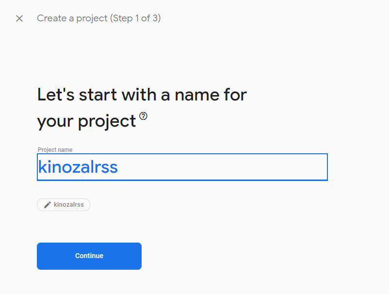
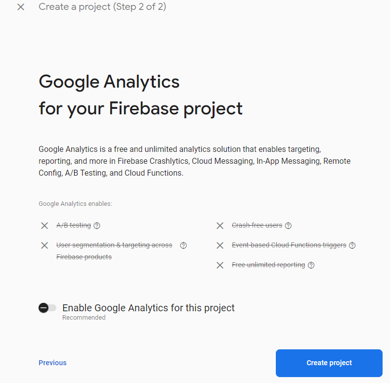
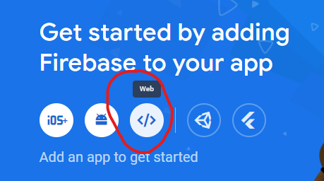
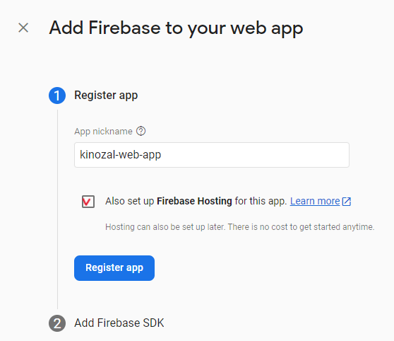
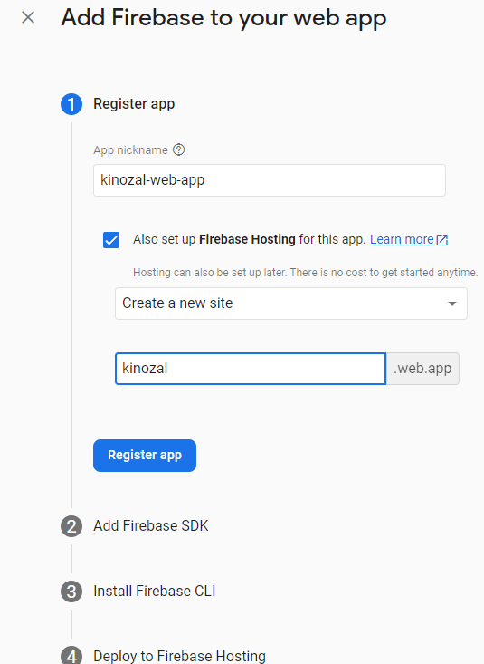
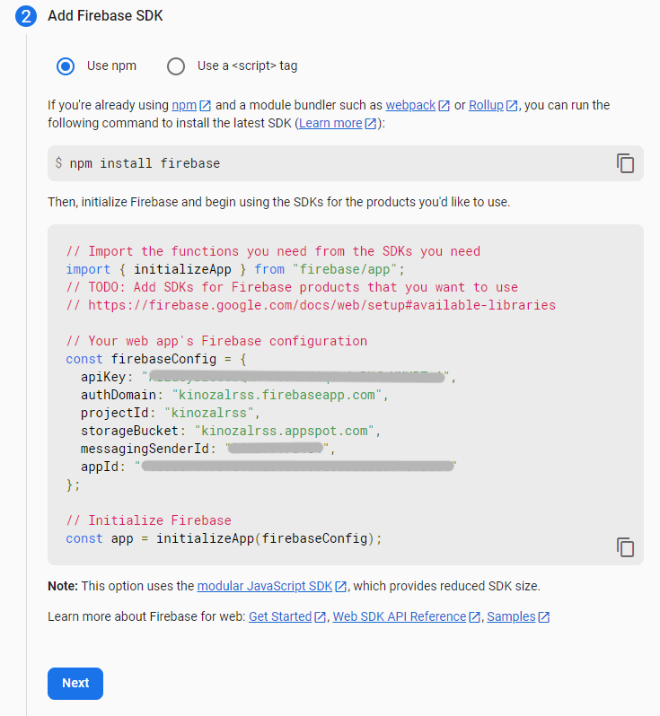
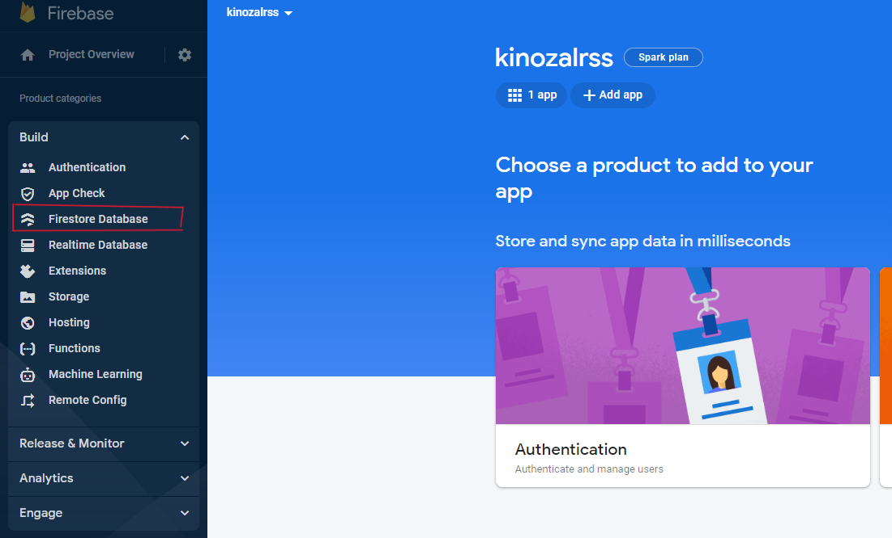
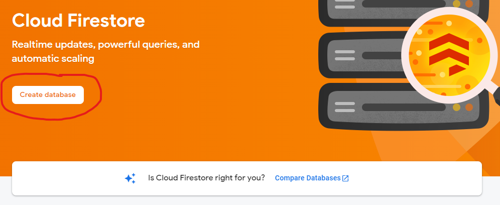
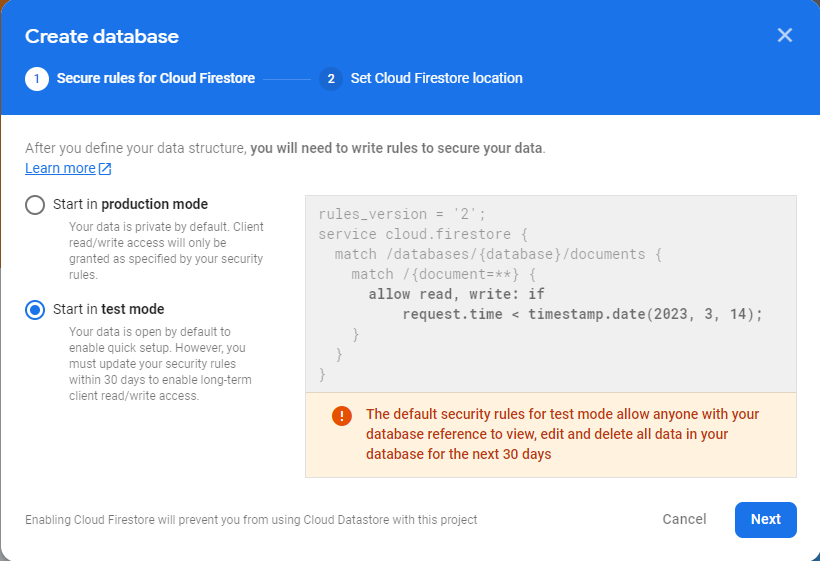
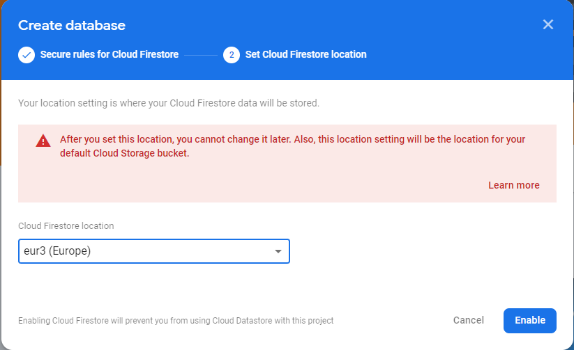

#### Создаем проект Vue ([doc's link](https://vuejs.org/guide/quick-start.html#creating-a-vue-application))

    npm init vue@latest  # let all by default
    cd <your-project-name>
    npm install
    npm run dev

#### Github

В этот момент нужно сделать репозиторий и залит туда проект. Во время настройки деплоя на firebase он уже должен
существовать.

#### Создаем проект Firebase

- идем в [консоль firebase](https://console.firebase.google.com/) и жмем `New Project`

- для простоты отключаем гугл-аналитику

- Мы создали "базу данных". Ей могут пользоваться разные приложение, на разных фреймворках. Добавляем
  в проект веб-приложение

- Вводим понятное название для нашего приложения и отмечаем галку "мы также хотим хостинг на firebase"

- И вводим название домена для нашего сайта

- Мастер говорит, что нужно установить firebase и сохранить найстройки подключения.

- Сохраняем настройки в корне проекта в файле .env.development. Внимание! Все переменные должны иметь префикс VITE_,
  иначе VITE их не прочитает по соотражениям безопасности.

      NODE_ENV=development
      VITE_APP_apiKey=AIzaxxxxxxNH-FxxxxxxxxxxxxxxxxxxxxA
      VITE_APP_authDomain=kinozalrss.firebaseapp.com
      VITE_APP_databaseURL=https://znakdb-dev.firebaseio.com
      VITE_APP_projectId=kinozalrss
      VITE_APP_storageBucket=kinozalrss.appspot.com
      VITE_APP_messagingSenderId=31111111114
      VITE_APP_appId=1:3xxxxxxxxxx4:web:exxxxxxxxxxxxxxxxxxe1

- устанавливаем на след шаге firebase cli (для хостинга)

      npm install -g firebase-tools

- делаем тестовый деплой на firebase

      firebase login
      firebase init (или firebase init hosting:github)
      (*) Hosting: Configure files for Firebase Hosting and (optionally) set up GitHub Action deploys
      (*) Hosting: Set up GitHub Action deploys

Next step:

      > Use an existing project

Next step:

      > kinozalrss (kinozalrss)

What do you want to use as your public directory? (public)

      dist

Configure as a single-page app (rewrite all urls to /index.html)? (y/N)

      yes

Set up automatic builds and deploys with GitHub? (y/N)

      yes

For which GitHub repository would you like to set up a GitHub workflow? (format: user/repository)

      swasher/kinozalrss

Set up the workflow to run a build script before every deploy?

      No (тут я не знаю, выбрал по-умолчанию)

Set up automatic deployment to your site's live channel when a PR is merged? (Y/n)

      Yes (тут я не знаю, выбрал по-умолчанию)

What is the name of the GitHub branch associated with your site's live channel? (master)

      master

После этого в нашем проекте появятся следующие файлы:
.firebaserc
firebase.json
public/index.html
.github/workflows/firebase-hosting-merge.yml
.github/workflows/firebase-hosting-pull-request.yml

Дальше нужно добавить `site ID` в firebase.json (строчка `"site": "kinozal",`):

    {
      "hosting": {
          "site": "kinozal",
          "public": "public",
          ...
      }
    }

Запускаем сборку, наш сайт должен собраться в папке `dist`:

      npm run build

Проверяем файл `firebase.json`. Хотя я указывал, что проект у меня будет собираться в `dist`, в `firebase.json` стояло
`"public": "public",`. Исправляем на `"public": "dist",`

И запускаем тестовый деплой:

    firebase deploy --only hosting:kinozal

Теперь по адресу `https://kinozal.web.app/` должна открыться заглушка Vue.

Возвращаемся в консоль firebase и завершаем мастер настрйки.

### Authentication

Жмем Build -> Authentication, Sign-in method, Email/Password -> Enable.

Далее идем в Users, и создаем первого юзера (себя).

### Создаем в 'проекте' firestore саму базу данныx.

Жмем сюда и выбираем Firestore database.

В кратце, в чем разница - Realtime database нужен тогда, когда записи базу являются событиясм для чего-то,
например это система обменя сообщениями, когда один пользователь что-то отправил (сделал запись в базу), а
у другого она тут же появилась. Если база у нас как "хранилище" - то выбираем обычную Firestore.

Жмем создать базу, выбираем тестовый режим и нужный регион.

### Настройка минимального проекта VueJS

Создаем src/firebase.js - здесь мы создаем объекты подлючения к firebase и импортируем их в других частях

    const firebaseConfig  = {
      apiKey: import.meta.env.VITE_APP_apiKey,
      authDomain: import.meta.env.VITE_APP_authDomain,
      databaseURL: import.meta.env.VITE_APP_databaseURL,
      projectId: import.meta.env.VITE_APP_projectId,
      storageBucket: import.meta.env.VITE_APP_storageBucket,
      messagingSenderId: import.meta.env.VITE_APP_messagingSenderId,
      appId: import.meta.env.VITE_APP_appId
    }

Очищаем проект от начальных файлов - удаляем все в src/components, src/assets, и содержимое App.vue.

